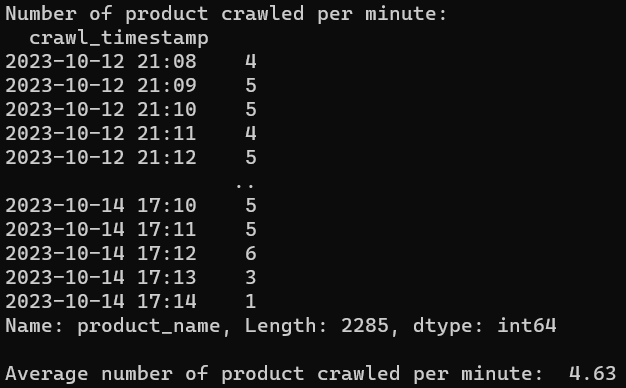
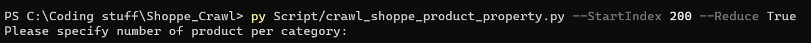
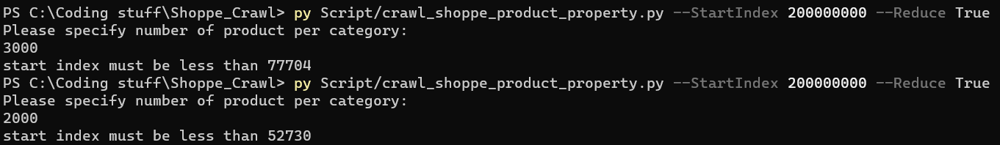

# Shoppe Crawl

<!-- ABOUT THE PROJECT -->
## About The Project
This project crawl product data from Shoppe in Vietnam by category. It haven't been tested with Shoppe in other nations yet but feel free to try

Output: A csv file with the following attributes:
| Column name     	| Meaning                                                                     	| Note                                                                                                                       	|
|-----------------	|-----------------------------------------------------------------------------	|----------------------------------------------------------------------------------------------------------------------------	|
| product_name    	| Name of the product                                                         	| None                                                                                                                       	|
| product_url     	| Link to the product page                                                    	| None                                                                                                                       	|
| product_rating  	| Rating of the product                                                       	| NaN value in this field means product has no rating                                                                        	|
| product_price   	| Price of the product                                                        	| Some product has price display in a range instead of a number. For these cases, only the minimize value in range are taken 	|
| product_revenue  	| Product profit                                                        	| Calculate by multiply price and number of product sold 	|
## Statistic

* The project is able to crawl data at a rate of 4-5 product per minute.
* As of 10/14/2023, the repo is able to crawl 130932 products in total
* A subset of this data, which contain 3100 products for each category has a total of 79904 products
* Increase crawl rate may result in getting bot detected faster (but you will be detected eventually, sooner or later)
## Known limitation
* Shoppe has its own policy that stated crawling is prohibited ([link here](https://seller.shopee.com.my/edu/article/11438/crawling-scraping#:~:text=Crawling%20refers%20to%20the%20indexing,are%20strictly%20prohibited%20on%20Shopee.)), which mean you have to bypass the bot detection of Shoppe. This project, unfortunately, is not able to bypass it. But in order to deal with this short coming, a work around has been implemented - the automate crawling and retry if detected.
* Has to use a VPN 
## Built With

* Python 3.11.5
* Selenium 4.13.0
* SeleniumBase 4.19.1
* Pandas 2.1.0


<!-- GETTING STARTED -->
## Getting Started
### Prerequisites

Install the following libraries, each separated by a line
* pip
  ```sh
  pip install pandas
  pip install seleniumbase
  pip install selenium
  ```

### Installation

Clone the repo
   ```sh
   git clone https://github.com/nguyenhoaibao123789/Shoppe_Crawl.git
   ```


<!-- USAGE EXAMPLES -->
## Usage
### 1. Cd to the workspace (repo folder)
```sh
cd path/to/repo
```
### 2. Run ```crawl_shoppe_product_link.py```
```sh
py Script/crawl_shoppe_product_link.py
```
After the run, there should be a csv file called ```all_product_link.csv``` generated which include product URL in folder like below

    .
    ├── Data/
    │   ├── Clean_product_data
    │   ├── Raw_product_data
    │   └── all_product_link.csv*
    ├── Doc
    ├── downloaded_files
    ├── extension
    └── Script
  
### 3. Run ```crawl_shoppe_product_property.py```
```sh
 py Script/crawl_shoppe_product_property.py --StartIndex start_index --Reduce True/False
```
| Argument     	| Short form 	| Type 	| Meaning                                                                             	| Possible value                                                                             	|
|--------------	|------------	|------	|-------------------------------------------------------------------------------------	|--------------------------------------------------------------------------------------------	|
| --StartIndex 	| -s         	| int  	| Specify at which row in the all_product_link.csv should the function start crawling 	| Any integer that smaller than length of all_product_link.csv or the dataframe after reduce 	|
| --Reduce     	| -r         	| str  	| Whether to reduce the number of product per category                                	| "true"/"false"                                                                             	|

For example
```sh
py Script/crawl_shoppe_product_property.py --StartIndex 200 --Reduce True
```

Running this script generate a file that name after a pattern ```shoppe_product_final_<start_index>_<end_index>.csv``` inside ```Raw_product_data``` folder

    .
    ├── Data
    │   ├── Clean_product_data
    │   ├── Raw_product_data
    │   │   ├── shoppe_product_final_<start_index>_<end_index>.csv*
    │   │   └── shoppe_product_final_<next_start_index>_<next_end_index>.csv*
    │   └── all_product_link.csv
    ├── Doc
    ├── downloaded_files
    ├── extension
    └── Script

If ```--Reduce``` or ```-r``` is set to ```true```, a command will appear as seen below, ask you to specify a number:



Also, if you specify the start index bigger than the total number of product, a message will prompt and ask you to call the function again but with smaller ```--StartIndex```, depend on the previous input, the limit number will change



### 4. Run ```raw_to_clean.py```
```sh
py Script/raw_to_clean.py
```
Running this command will generate a CSV file ```product.csv``` which combine all the csv files in ```Raw_product_data``` folder and write a cleaned CSV file with columns defined in [About the project](#about-the-project)

    .
    ├── Data
    │   ├── Clean_product_data
    │   │   └── product.csv*
    │   ├── Raw_product_data
    │   └── all_product_link.csv
    ├── Doc
    ├── downloaded_files
    ├── extension
    └── Script

